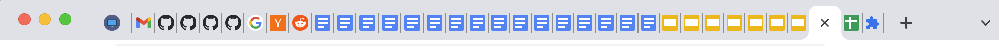
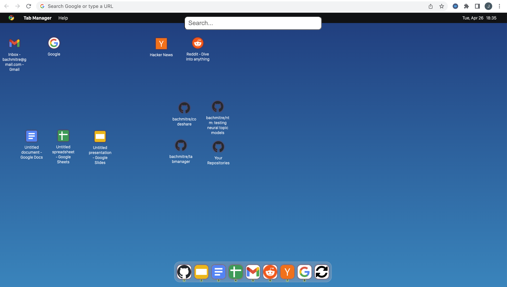
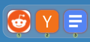
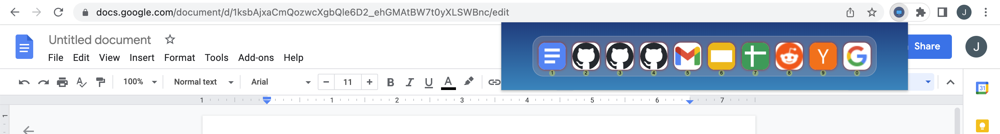

Tab Manager
---

Which tab is wich ?

Tired of squinting at the squished-together 30 open tabs in the tab bar to find the right one?

Here comes **Tab Manager**, a chrome extension to help you organize and easily find your open tabs by displaying them as a desktop! 

Each tab is represented by its favicon, 
which can be dragged to any position on the desktop. 
The 10 most recently used tabs are displayed in order of their last use in the dock on the bottom.

Quickly change to any of the recently used tabs by pressing the associated number key:

Click on an icon to quickly switch to that tab, or close the tab by clicking on the close button on hovering:

- 
- Drag the tab icons to reorder them.
- Switch to the tab by clicking on the icon.
- Hovering over the icon will display a little button to close the tab.
- The toolbar on the bottom shows up to 10 recent tabs, the most recent being on the left, and the oldest on the right.

The same toolbar is also available when displaying the extensions popup page:

### How I use it
The desktop page is set to be the default page when opening a new tab, 
so opening a new tab will display the new tabs desktop page.
Pin this tab, which will move the tab to be your "first" tab:

Now you can quickly switch to the tab desktop by clicking "command + 1"
From here, use the number keys to quickly switch to the first, second, third, etc. most recent tab.

### ToDo
- remember tab positions on desktop after browser restart
- organize tabs in folders (only if I can get the previous point working)

### Inspired by
- https://codepen.io/vihanga/pen/gOmXvRr
- https://github.com/kylepaulsen/SuperBookmarkDesktop

### License
MIT

---

 If you like this extension, please consider to 

